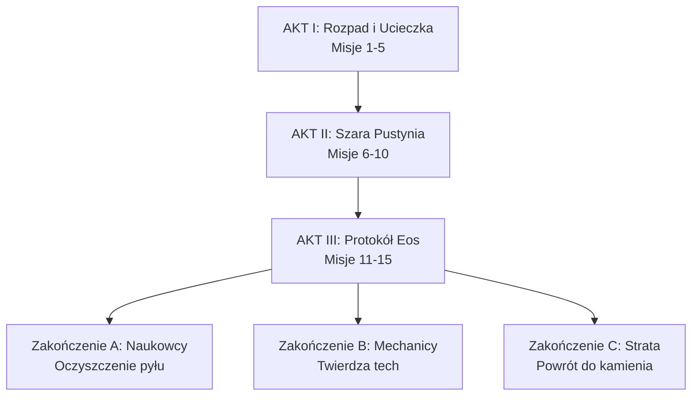

# Protokół Ziemia Jałowa — Przegląd Kampanii

> Kompletny plan kampanii 15 misji do moda Original War. 
> Wersja robocza z 2026-09-10. Źródło: Gemini + iteracje.

## Koncepcja Rdzenia

- **Ciągłość składu:** system `SaveCharacters` / `persistent` w `characters.txt` — każda strata jest permanentna (jak w bazowej kampanii OW)
- **Brak tradycyjnej rozbudowy baz:** brak depot/fabryk w klasycznym sensie, tylko przejmowanie i naprawa
- **Ograniczone zasoby:** amunicja + paliwo (`SetFuel`) liczone globalnie
- **Mechaniki SAIL:** każda misja ma 1 mechanikę główną pisaną custom

## Mapa Kampanii — 15 Map Indywidualnych

> [!important] Każda misja = osobna mapa `.map` — szczegóły w [[00 - Mapy Przegląd|Mapy Przegląd]]

| # | Misja | Akt | Lokacja | Mapa `.map` | Rozmiar | Mechanika SAIL | Status |
|---|-------|-----|---------|-------------|---------|----------------|--------|
| 1 | [[01 Akt I - Rozpad i Ucieczka/01 - Ostatnia Iskra\|Ostatnia Iskra]] | I | Ruiny bazy Alpha | `01_ostatnia_iskra.map` | 72x72 | Samouczek, skradanie | `design` |
| 2 | [[01 Akt I - Rozpad i Ucieczka/02 - Droga przez Rdzę\|Droga przez Rdzę]] | I | Kanion Wiatru | `02_droga_przez_rdze.map` | 96x48 | Licznik paliwa | `design` |
| 3 | [[01 Akt I - Rozpad i Ucieczka/03 - Pierwsza Pomoc\|Pierwsza Pomoc]] | I | Posterunek medyczny | `03_pierwsza_pomoc.map` | 80x80 | Choroba pyłowa | `design` |
| 4 | [[01 Akt I - Rozpad i Ucieczka/04 - Cmentarzysko Czołgów\|Cmentarzysko Czołgów]] | I | Pole bitwy Samurai | `04_cmentarzysko_czołgów.map` | 100x100 | Demontaż, hałas | `design` |
| 5 | [[01 Akt I - Rozpad i Ucieczka/05 - Brama na Północ\|Brama na Północ]] | I | Przełęcz górska | `05_brama_na_północ.map` | 64x96 | Materiały wybuchowe | `design` |
| 6 | [[02 Akt II - Szara Pustynia/06 - Wolne Targowisko\|Wolne Targowisko]] | II | Enklawa Nowa Nadzieja | `06_wolne_targowisko.map` | 64x64 | Dialogi, rekrutacja | `design` |
| 7 | [[02 Akt II - Szara Pustynia/07 - Czysty Tlen\|Czysty Tlen]] | II | Dolina subarktyczna | `07_czysty_tlen.map` | 96x96 | Obrona, wieżyczki | `design` |
| 8 | [[02 Akt II - Szara Pustynia/08 - Wzmocnienie Konwoju\|Wzmocnienie Konwoju]] | II | Garaż ZSRR | `08_wzmocnienie_konwoju.map` | 80x64 | Craft pojazdu | `design` |
| 9 | [[02 Akt II - Szara Pustynia/09 - Anomalia Łza\|Anomalia Łza]] | II | Strefa zerowa | `09_anomalia_łza.map` | 112x112 | Strefy czasowe RNG | `design` |
| 10 | [[02 Akt II - Szara Pustynia/10 - Przechwycenie Sygnału\|Przechwycenie Sygnału]] | II | Wieża nadawcza | `10_przechwycenie_sygnału.map` | 96x96 | Survival 3 kier. | `design` |
| 11 | [[03 Akt III - Protokół Eos/11 - Zamarznięta Pamięć\|Zamarznięta Pamięć]] | III | Archiwum EON-2 | `11_zamarznięta_pamięć.map` | 64x64 | Indoor, latarki | `design` |
| 12 | [[03 Akt III - Protokół Eos/12 - Czerwony Zmierzch\|Czerwony Zmierzch]] | III | Koryto rzeki | `12_czerwony_zmierzch.map` | 128x48 | Konwoje, lód | `design` |
| 13 | [[03 Akt III - Protokół Eos/13 - Baza Eos Przedpola\|Baza Eos - Przedpola]] | III | Kompleks Eos | `13_baza_eos_przedpola.map` | 112x112 | Hackowanie | `design` |
| 14 | [[03 Akt III - Protokół Eos/14 - Bitwa w Kraterze\|Bitwa w Kraterze]] | III | Krater Szochowa | `14_bitwa_w_kraterze.map` | 128x128 | Podział sił | `design` |
| 15 | [[03 Akt III - Protokół Eos/15 - Ostatni Świt\|Ostatni Świt]] | III | Serwerownia Eos | `15_ostatni_świt.map` | 80x80 | Finał, test składu | `design` |

## Zakończenia - Misja 15

> [!important] Warunek zakończenia
> Zależy od `CountCharactersWithProfession()` na koniec kampanii.

- **Naukowcy przeżyli** → filtr oczyszcza plejstocen, uprawy możliwe
- **Mechanicy/Inżynierowie przeżyli** → twierdza technologiczna samowystarczalna
- **Większość stracona** → filtry działają krótko, rozproszenie, regres do ery kamienia

## Fabuła — NOWA HISTORIA, NIE KONTYNUACJA ORI

- **Zasada:** nowa historia nie związana z ori — tylko fizyka OW (Syberyt, EON) — `05 Fabuła/00 - Oś Fabuły.md:1`
- **Oś:** [[05 Fabuła/00 - Oś Fabuły|00 Oś Fabuły]] — Protokół Ziemia Jałowa (failsafe RU, 15 misji, alternatywny skok 2004)
- **Bohaterowie 5+2 od zera:** [[05 Fabuła/01 - Bohaterowie Druzyny|01 Bohaterowie Drużyny]] — Elena, Yuri, Viktor Drachev, Maya, Karim + Wiktor/Farid (żaden z ORI)
- **Frakcje nowe:** [[05 Fabuła/02 - Frakcje i Relacje|02 Frakcje i Relacje]] — Legion Alya vs RU Miron Karpov vs Sojusz (nowe ekspedycje)
- **Kto kogo odstrzeli:** [[05 Fabuła/03 - Kto Kogo Odstrzeli|03 Kto Kogo Odstrzeli]] — 6 strzałów fabułarnych 05/12/14/15
- **Oś 15 misji:** [[05 Fabuła/04 - Oś Czasowa 15 Misji|04 Oś Czasowa 15 Misji]]

## Folder Projektu — Rozdzielone

- **Kod SAIL + mapy:** `C:\Users\user\Desktop\ow mod test\` — `maps/01_akt_I/` `02_akt_II/` `03_akt_III/` + `missions/` (15 placeholderów)
- **Design doc:** ten vault `OW-Protokół-Ziemia-Jałowa/` — karty misji + [[00 - Mapy Przegląd|Mapy Przegląd]] (każda mapa indywidualna) + [[05 Fabuła/00 - Oś Fabuły|Fabuła]]
- **Silnik:** Original War 1.09+ / W:ET

## Next Steps

- [ ] Uzupełnić karty postaci persistent (5 startowych + 2 rekrutów z Misji 6)
- [ ] Zdefiniować balans paliwa/ammo globalnie
- [ ] Prototyp Misji 02 - paliwo (najtrudniejsza mechanika wcześnie)
- [ ] Mapy - szkice w Edytorze OW

---
*Tagi do filtrowania:* `#misja` `#mechanika` `#sail` `#do-zrobienia`
