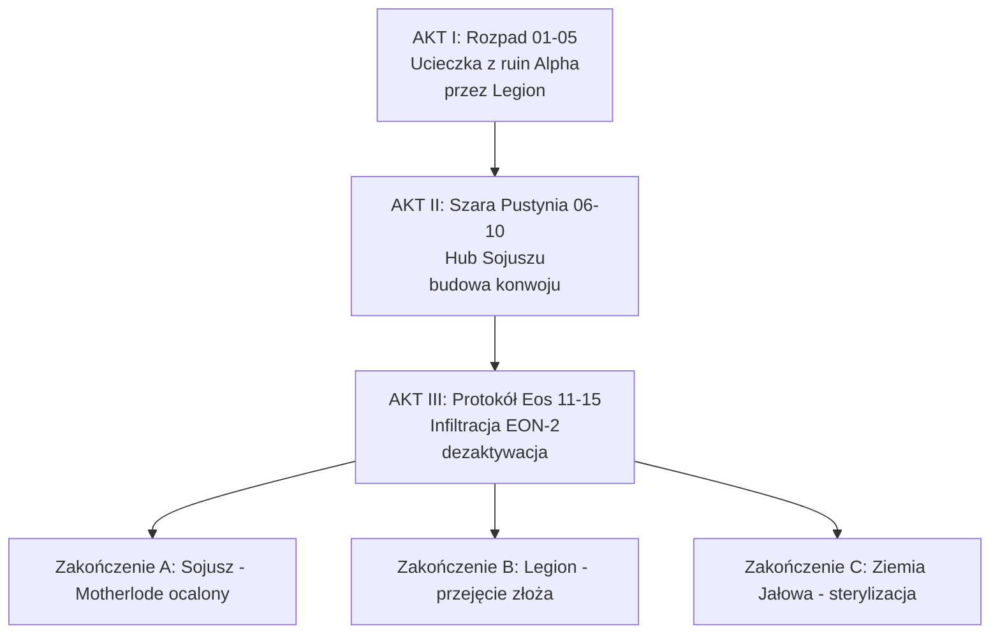

# Oś Fabuły — Protokół Ziemia Jałowa

> **MOD TO NIE KONTYNUACJA ORI — NOWA HISTORIA.** Kampania 15 misji w **nowym wątku, nie związanym z ori**. Korzysta tylko z zasad fizyki OW (`mat_siberite` Syberyt/Alaskit, silniki `combustion/solar/siberite`, EON jednokierunkowy 2M lat ±10 mil/5 lat — `original-war.net`), ale **wszystkie postacie, bazy, frakcje, wydarzenia są nowe, od zera**. Zero powtórzeń z oryginału.

## Premis — Nowa Historia

**Alternatywna linia czasowa. Rok 2004 — trzeci skok EON (nie z kampanii ORI).**
Zamiast dwóch mocarstw, w skoku biorą udział trzy ekspedycje wysłane jednocześnie przez błąd koordynacji: **Amerykanie (bazy kryptonim Alpha-Epsilon)**, **Rosjanie (bazy kryptonim Kirow/Beria)** i **prywatny Legion (bazy New Kabul/New Kaaba, liderka Alya Hassan)** — każda z własnym EON i własnym celem wydobycia Syberytu. Żadna z nich nie zna oryginalnej historii OW.

Wszystkie trzy EON-y lądują w tej samej niecce 2M lat p.n.e., ale rozproszenie 10 mil rzuca je na różne krańce doliny. Po 6 miesiącach izolacji Rosjanie uruchamiają **Protokół „Ziemia Jałowa”** — ich failsafe: jeśli stracą kontrolę nad niecką, wysterylizować ją 3 rakietami syberytowymi (`ru_siberium_rocket` + `tech_SibFiss`) i uniemożliwić wydobycie wszystkim.

Gracz dowodzi **Drużyną Sojuszu** — 5 ocalałych z *nowych* ekspedycji (nie z ORI), które dezerterują i tworzą czwartą siłę: **Sojusz Wolnych**. Muszą przejść przez tereny Legionu i Rosjan, zdobyć zapasowy moduł **EON-2** i dezaktywować Protokół zanim Miron Karpov wystrzeli.

> Tytuł „Ziemia Jałowa” = ziemia po sterylizacji syberytowej — jałowa na tysiące lat. Nie kontynuacja, tylko nowy wątek w tych samych zasadach fizyki.

## Stawka

- **Jeśli Sojusz wygra:** Motherlode zostaje, można go wydobywać bezpiecznie, Apemeni + ludzie współistnieją, EON-2 pozwala wysłać sygnał powrotu (nie ludzi, ale dane).
- **Jeśli Protokół wypali:** niecka jałowa, Sojusz rozproszony, ludzkość w tej linii czasowej cofa się do epoki kamienia (nawiązanie do zakończenia C).

## Struktura 3 Aktów (15 map indywidualnych)

| Akt | Misje | Cel fabułarny |
|---|---|---|
| **I: Rozpad** | 01 Ostatnia Iskra — 05 Brama na Północ | Ucieczka z ruin amerykańskiej bazy Alpha (zniszczonej przez Legion), przez Kanion Wiatru (patrole Legionu), do Enklawy Sojuszu. Poznanie drużyny. |
| **II: Szara Pustynia** | 06 Wolne Targowisko — 10 Przechwycenie Sygnału | Hub Sojuszu (New Samarkand ruiny) — wybór sojusznika (Legion vs Sojusz), budowa konwoju (2 pojazdy HT + Half-Tracked), przejście przez strefę syberytową, nadanie sygnału do rozproszonych. |
| **III: Protokół Eos** | 11 Zamarznięta Pamięć — 15 Ostatni Świt | EON-2 pod lodem, pojedynek z Legionem, hakowanie pierścienia Eos, wyścig z rakietami, finałowa obrona filtra syberytowego. |

## Zakończenia (zależy kto przeżyje — `CountProfession` + relacje)

- **A Sojusz (Naukowcy żyją):** Yuri + Maya uruchamiają filtr, Motherlode stabilny, Sojusz zakłada osadę z Apemenami.
- **B Legion (Mechanicy żyją):** Elena + Viktor przekształcają EON-2 w twierdzę Legionu, handel Syberytem.
- **C Ziemia Jałowa (większość martwa):** Protokół częściowo wypala, filtr 20%, rozproszenie.

## Zasady nowego wątku (nie kontynuacja)

- **Zero kontynuacji ORI:** żadnych powrotów Macmillan/Burlak/Heike, żadnych baz Alpha z kampanii ORI — nasze Alpha/Kirow/New Kabul to *nowe* ekspedycje 2004 w alternatywnej linii, tylko nazwy kodowe zapożyczone z `campaign_bases` jako inspiracja
- **Postacie 100% nowe:** Elena, Yuri, Viktor Drachev, Maya, Karim, Wiktor, Farid, Alya Hassan, Miron Karpov — stworzone od zera, nie krewni nikogo z ORI
- **Fizyka ta sama:** EON jednokierunkowy, `mat_siberite` Syberyt/Alaskit, silniki, `tech_MatPred/MatDet` — `eon` — ale historia polityczna nowa

---
*Następne:* [[01 - Bohaterowie Druzyny|01 Bohaterowie]] · [[02 - Frakcje i Relacje|02 Frakcje]] · [[03 - Kto Kogo Odstrzeli|03 Kto Kogo Odstrzeli]]
