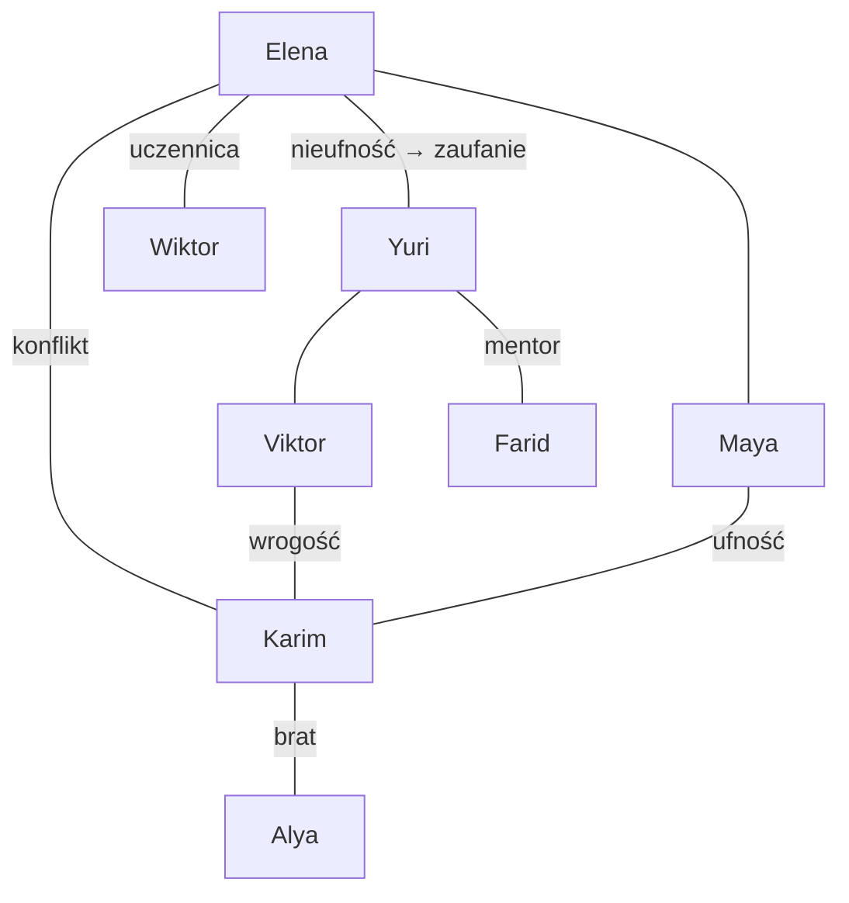

# Drużyna Gracza — 5+2 (persistent) — WSZYSTKO OD ZERA

> Wszyscy `persistent=1` w `characters.txt`. Śmierć permanentna → wpływa na finał `15 - Ostatni Świt`. **Wszystkie postacie nowe, nie powtarzamy żadnych z oryginalnego wątku OW** — stworzone od zera dla moda.

| # | Imię / Call | Frakcja | Klasa | Wiek | Rola w drużynie | Charakter | Przeżywalność |
|---|---|---|---|---|---|---|---|
| **1** | **Elena Varga** „Echo” | ex-USA (Alpha) | Mechanik `class_mechanic` | 29 | Dowódczyni, kierowca HT, naprawy w polu | Pragmatyczna, twarda, straciła brata w skoku EON. Nie ufa Rosjanom. | Musi przeżyć do 15 dla zakończenia B |
| **2** | **Dr Yuri Kamarov** | ex-RU (Baza Kirov) | Naukowiec `class_scientistic` | 41 | Syberyt/Alaskit, dekontaminacja, hack EON-2 | Cyniczny idealista, twórca filtra. Przyjaciel Eleny, wróg Miron Karpova. | Musi przeżyć dla zakończenia A |
| **3** | **Sierż. Viktor Drachev** | RU (ex-Kirow) | Żołnierz `class_soldier` → `class_bazooker` | 33 | Szturm, bazooka, ochrona Yuri | Lojalny do bólu, nie znosi Legionu. Konflikt z Karimem. | Może zginąć w 14 jeśli gracz podzieli źle siły |
| **4** | **Maya Torres** | USA (Epsilon) | Inżynier `class_engineer` | 24 | Budowa, demontaż wraków, materiały wybuchowe | Młoda, wierzy w Sojusz. Siostra Eleny (emocjonalny hak). | Śmierć w 05 = brak ładunków w 14 |
| **5** | **Karim Al-Rashid** | Arab/Legion dezerter | Wojownik Pustyni `class_desert_warior` + Mastodon | 35 | Zwiad, Mastodon, negocjacje z Legionem | Honorowy, rozdarty: Legion to jego bracia, ale Alya zwariowała. | Wybór w 06 decyduje czy zostanie |
| **6a** | **Wiktor Volkov** *albo* | RU | Mechanik `class_mechanic` | 38 | Buff do pojazdów, craft w 08 | Stary wyga, mentor Eleny. Tylko jeśli wybór w 06 = Sojusz | Jeden z dwóch — wybór w [[06 - Wolne Targowisko|06]] |
| **6b** | **Farid Al-Hadi** *albo* | Arab | Naukowiec-Medyk `class_scientistic` | 32 | Leczenie, filtry, finał A | Spokojny, zna Alya od dziecka. Tylko jeśli wybór = Legion | Jeden z dwóch |

## Relacje — kto z kim (graf)

- **Elena ↔ Yuri:** byli wrogowie (USA vs RU w 01), muszą zaufać. Ich relacja to oś Aktu I. Jeśli Yuri zginie, Elena traci hamulec i staje się bezwzględna.
- **Viktor ↔ Karim:** otwarta wrogość. Viktor nazywa Karima „zdrajcą Legionu”, Karim Viktora „rzeźnikiem Kirowa”. Kulminacja w **Misji 12** — pojedynek słowny na lodzie, może przejść w strzelaninę jeśli gracz źle wybierze dialog.
- **Maya ↔ Karim:** jedyna nić zaufania do Legionu. Maya wierzy, że Karim sprowadzi Legion na stronę Sojuszu.
- **Wiktor / Farid:** wzajemnie się wykluczają. Wiktor daje buff mechaniczny, Farid medyczny/filtr.

## Krótkie Życiorysy — Postapo

### 1. Elena Varga „Echo” (29, ex-USA, Mechanik)
Urodzona w Detroit, dzieciństwo w warsztacie ojca spawającego ramy do ciężarówek. W 2003 zgłosiła się do programu EON bo „na Ziemi i tak nie ma dla niej tlenu” — brat zginął w wypadku przy `engine_siberite`. W niecce straciła załogę Alpha w 2 dni — została sama z HT i kluczem 17. Mówi mało, naprawia dużo. Czarny humor: „Jak to nie odpali, to przynajmniej będzie ciepło jak wybuchnie.” Jej Mastodon to nie pojazd, to trumna na gąsienicach, ale jedzie.

### 2. Dr Yuri Kamarov (41, ex-RU, Naukowiec)
Leningrad, Instytut Fizyki Syberytu. W 2004 podpisał Protokół Ziemia Jałowa jako „teoretyczny bezpiecznik, nigdy nie użyty”. Teraz ten podpis chce go zabić. W niecce pije bimber z kondensatu, bo twierdzi że „dezynfekuje od środka”. Jedyny kto rozumie `tech_SibFiss`. Do Eleny: „Ty naprawiasz silniki, ja naprawiam sumienie. Gorzej mi idzie.”

### 3. Sierż. Viktor Drachev (33, RU, Żołnierz → Bazooker)
Kirow, piechota zmechanizowana. W skoku stracił cały pluton — został Yuri, bo Viktor go wyciągnął z płonącego `Heavy Wheeled`. Od wtedy „dług”. Nienawidzi Legionu, bo w Kanionie Wiatru (02) Legion zostawił jego ludzi bez paliwa. Motto: „Najpierw strzelaj, potem sprawdź czy to był rozkaz.” Pod czarnym humorem — panicznie boi się, że Yuri go zostawi.

### 4. Maya Torres (24, USA, Inżynier)
Siostra Eleny (przyrodnia, ta sama matka, inni ojcowie — Elena nigdy nie mówi o tym głośno). Z Epsilon, najmłodsza w programie, wysłana bo „zna się na spawaniu i nie zada pytań”. Wierzy w Sojusz jak w religię, bo inaczej musiałaby przyznać że są zgubieni. W 05 sama podkłada ładunki, bo „jak nie ja, to kto? Wszyscy inni mają ważniejsze wymówki.” Jej śmierć = brak ładunków w 14.

### 5. Karim Al-Rashid (35, Legion dezerter, Desert Warrior)
New Kabul, hodowca Mastodontów. W Legionie od 16 roku życia, uczył się jeździć zanim czytać. Zdezerterował gdy Alya Hassan kazała zostawić rannych w Kanionie. Jego Mastodon „Bura” to jedyny transport co nie tonie na lodzie 12. Honorowy do bólu, co w postapo jest wadą fabryczną. „Zdradziłem braci, żeby nie zdradzić siebie. Teraz obie strony mnie chcą zastrzelić — przynajmniej popularny jestem.”

### 6a. Wiktor Volkov (38, RU, Mechanik) — ALBO
Kirow, stary wyga `engine_combustion`. W 2004 uczył Elenę jak oszukać czujnik paliwa. Jeśli go wybierzesz w 06, daje buff -20% zużycia paliwa i +10 obr. do HT. Mówi: „Silnik siberite to bzdura. Daj mi ropę i młotek, a pojadę na Księżyc.” Wybór Sojuszu.

### 6b. Farid Al-Hadi (32, Arab, Naukowiec-Medyk) — ALBO
New Kaaba, medyk Legionu, zna Alya od dziecka (byli w tej samej celi w szkole koranicznej). Cichy, myje ręce nawet gdy nie ma wody. Zna filtry syberytowe lepiej niż Yuri. Jeśli go wybierzesz, Alya do 12 pozostaje neutralna. „Leczę tych, których jutro będę musiał opatrzyć po tym jak ich postrzelicie. Stabilne zatrudnienie.” Wybór Legionu.

## Wątki per postać

- **Elena:** łuk od zadaniowca do liderki Sojuszu. Musi w 15 wybrać: ocalić Motherlode (długoterminowo) czy ludzi (teraz).
- **Yuri:** chce naprawić podpis z 2004. Poczucie winy = chce zginąć przy rozbrajaniu 14, by odkupić.
- **Karim:** zdrada = wyrok Alya. Jego Mastodon jedyny na lód 12.
- **Maya:** jeśli zginie w 05, brak inżyniera w 14 — piekło.
- **Viktor:** osłania Yurie w 14; jeśli zginie, Yuri załamuje się i filtr słabszy.

## Reguła persistent

W `characters.txt` wszyscy `persistent=1`, `nation_*` i `class_*` jak wyżej. W `01 - Plan TODO.md` Faza 2 test: zabij 1 w 02 → brak w 03.
